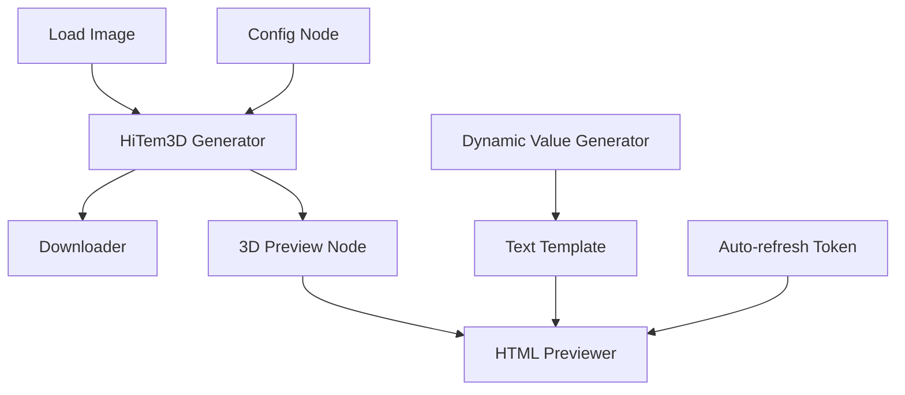

# HiTem3D Examples & Workflows

Complete collection of example workflows demonstrating the HiTem3D ComfyUI integration with HTML preview capabilities.

## 📁 Available Examples

### 🎯 Basic 3D Generation
**File:** `hitem3d_basic_workflow.json`

Complete workflow for converting images to 3D models:
```
[Load Image] → [Generator] → [Downloader] → [3D Preview]
     ↓             ↓            ↓           
[Config Node] → [Text Outputs] ←→ [Text Outputs]
```

**Features:**
- Image to 3D conversion
- Interactive 3D preview
- Download management
- Status monitoring

### 🌐 HTML Preview System  
**File:** `html_previewer_workflow.json`

Advanced workflow combining 3D generation with HTML preview:
```
[3D Generation Pipeline] → [HTML Preview] ← [Dynamic Values]
                             ↓
                      [Auto-Refresh System]
```

**Features:**
- Live HTML preview in ComfyUI
- Auto-refresh with dynamic tokens
- Template processing with placeholders
- Secure content serving

### 📄 Demo Content
**File:** `enhanced_preview_demo.html`

Sample HTML file for testing the HTML preview system with:
- Interactive 3D model viewer
- Modern responsive design
- Dynamic content placeholders
- Professional styling

## 🚀 Quick Start Guide

### 1. Basic 3D Generation
1. Load `hitem3d_basic_workflow.json` in ComfyUI
2. Configure API credentials in HiTem3DConfigNode
3. Load your image in LoadImage node
4. Run workflow and view results

### 2. HTML Preview Testing
1. Load `html_previewer_workflow.json` in ComfyUI
2. Run workflow to generate 3D content
3. Click **🎯 HTML Preview** button in toolbar
4. Watch auto-refresh as you re-run the workflow

## 🔧 Node Configuration

### Core Nodes Required

#### HiTem3D Generator Node
- **Model**: `hitem3dv2.0` (new) or `hitem3dv1.5` (recommended)
- **Resolution**: `1024` (balanced quality/speed)
- **Format**: `glb` (best compatibility)
- **Generation Type**: `all_in_one` (geometry + textures)

#### HTML Previewer (Local)
- **HTML Content**: Connect from 3D Preview or Text Template
- **Auto-refresh Token**: Connect from Dynamic Value Generator

#### Dynamic Value Generator
- **Value Type**: `timestamp` (for auto-refresh)
- **Custom Prefix**: `refresh_` (optional)
- **Format**: `%Y%m%d_%H%M%S` (timestamp format)

#### Text Template
- **Template**: HTML content with `{{placeholders}}`
- **Values**: Dynamic content from other nodes

## 📊 Workflow Components

### Data Flow Example


### Output Connections
- **Model URL** → Downloader input
- **HTML Content** → HTML Previewer input
- **Dynamic Values** → Template processing
- **Preview URLs** → Browser access

## 🎮 Interactive Features

### HTML Preview Panel
- **Draggable Interface**: Move preview windows
- **Auto-detection**: Finds HTML previewer nodes automatically
- **Status Indicators**: Shows loading/ready states
- **Refresh Controls**: Manual and automatic refresh

### 3D Preview Controls
- **Interactive Rotation**: Mouse control
- **Zoom & Pan**: Scroll and drag
- **Display Options**: Wireframe, grid, background
- **File Info**: Vertex count, format details

## 🔄 Auto-Refresh System

### How It Works
1. Dynamic Value Generator creates changing tokens
2. Text Template processes HTML with dynamic content
3. HTML Previewer detects token changes
4. Preview refreshes automatically

### Best Practices
- Use timestamp tokens for time-based refresh
- Use counter tokens for execution-based refresh
- Include dynamic values in HTML templates
- Test refresh behavior with different token types

## 📚 Documentation Links

- **Main README**: Complete feature overview
- **HTML_PREVIEWER_README**: Detailed HTML system guide
- **QUICK_SETUP**: Installation and configuration
- **TROUBLESHOOTING**: Common issues and solutions

## 🛠️ Requirements

### Essential
- Valid HiTem3D API credentials
- ComfyUI with custom nodes support
- Input images (JPEG, PNG, WebP)
- Sufficient HiTem3D account credits

### Optional Extensions
- **ShowText|pysssss**: For text display nodes (used in basic workflow)
- **Browser**: For external HTML preview access

## 🎯 Use Cases

### 3D Content Creation
- Character modeling from photos
- Product visualization
- Architectural previews
- Game asset generation

### HTML Preview Applications
- 3D model galleries
- Interactive documentation
- Real-time content updates
- Dashboard creation

## ⚠️ Important Notes

### API Configuration
- Configure API keys before first use
- Use setup wizard: `setup_wizard.py`
- Add credits to HiTem3D account
- Test connection with basic workflow

### File Management
- Generated models saved to `output/hitem3d/`
- HTML previews in `output/hitem3d/previews/`
- Secure path validation enforced
- Only `.html` and `.htm` files served

## 🆘 Troubleshooting

### Common Issues
1. **Missing Nodes**: Restart ComfyUI after installation
2. **API Errors**: Check credentials and account balance
3. **Preview Not Loading**: Verify HTML content and file paths
4. **Auto-refresh Not Working**: Check token connections

### Getting Help
- Check `TROUBLESHOOTING.md` for detailed solutions
- Visit [www.geekatplay.com](https://www.geekatplay.com) for support
- Review HiTem3D API documentation

## 📝 Created by Geekatplay Studio

**Website:** [www.geekatplay.com](https://www.geekatplay.com)  
**YouTube:** [@geekatplay](https://www.youtube.com/@geekatplay)  
**Get HiTem3D Credits:** [https://www.hitem3d.ai/?sp_source=Geekatplay](https://www.hitem3d.ai/?sp_source=Geekatplay)